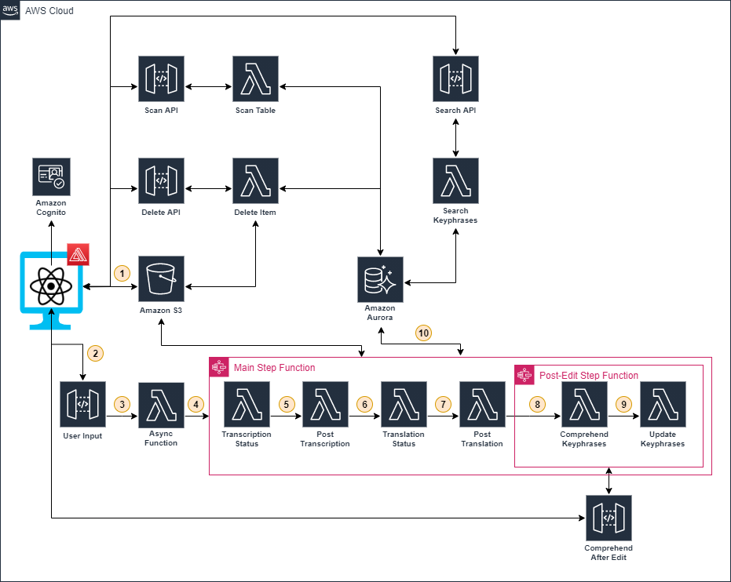

# T2 - Transcribe and Translate

## Project Summary

The T2 - Transcription and Translation tool enables users to upload audio and video files to be transcribed and then translated to their desired language. The audio or video files, the transcriptions and the translations are stored in a S3 bucket. The translation can be edited by the user from the User Interface (UI) incase of any irregularities. The transcripts will then be uploaded to an Amazon Aurora database after using AWS Comprehend to identify the key phrases. This will allow the user to search previously completed translations using key phrases as well and create a database of completed translations.

## High-level Architecture

## Deployment

[Backend Stack Deployment](/docs/backend-README.md) (points to the historical audio processing repository)\
[Frontend Stack Deployment](/docs/frontend-README.md)

## Credits
This prototype was coded and architected by Kishlay Chhajer and Sathvik Radhakrishnan, with guidance from the UBC CIC tech and project teams and with quoted usage and reference to some AWS sample template projects.

## License
This project is distributed under the [MIT License](./LICENSE).