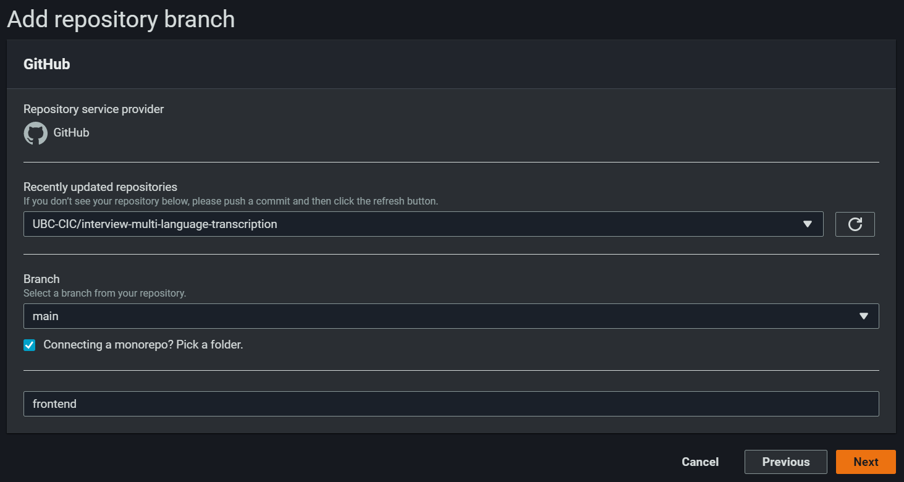
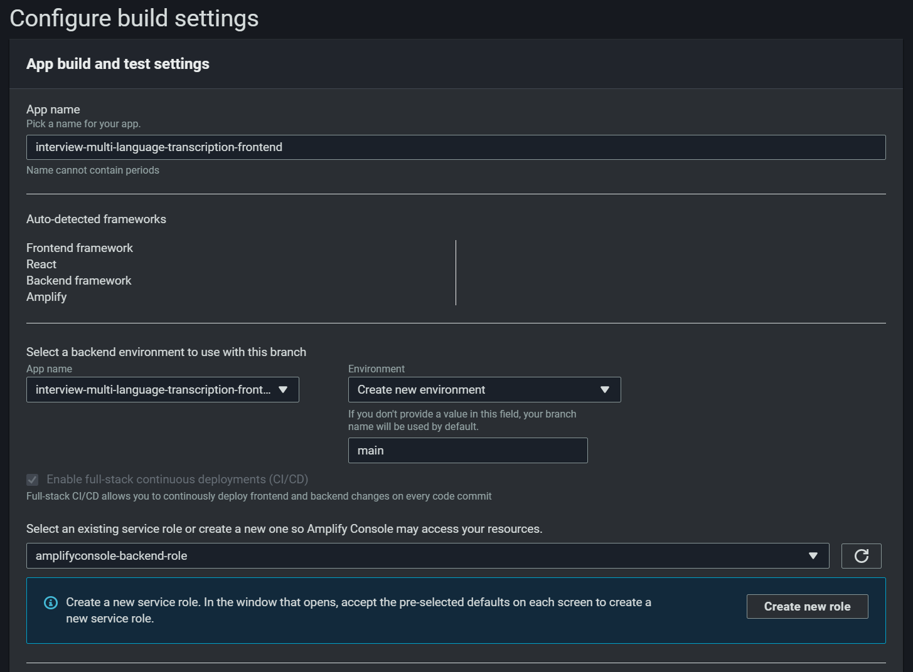

## Frontend deployment

You will need the following resources before deploying:
* [AWS Account](https://aws.amazon.com/account/)
* [GitHub Account](https://github.com)

1) Fork and clone this repository into your Github account.
2) From the AWS Amplify page in the AWS Console, select **Host web app** under the **New app** dropdown, and select 
   Github as the repository option.
3) After authenticating into your Github account, select the forked repository under the repository dropdown. Leave 
   the default branch as is. Select the **frontend** mono-repository
   
   NOTE: You will need to give permissions to the Amplify service to access your github account

4) On the next page, **App build and test settings**, keep the default build settings. You can rename the app name.
5) Select **Create new environment** under the **Select a backend environment** dropdown and type **main**, 
then select your AWS Amplify service role in the following dropdown if one exists; if not, Select 
   'Create new role' and quickly create one using the default settings and refresh the role selection.

6) Review the settings and click **Save and deploy**, and wait for the deployment build to complete, which will take 
   some time.

7) Once the deployment is completed. Follow these steps to give your application access to S3.

   a) Search for IAM in the search bar and select the IAM resourse.
   
   b) Click on Roles on the right hand side menu
   
   c) Search " -authRole " in the search bar
   
   d) Select the role auth role for your amplify deployment. It will be of the format amplify-frontend-main-{5-digit-number}-authRole
   e) Click on attach policies
   
   f) Search for S3 and select AmazonS3FullAccess. Then click on the button on the bottom right that says Attach policy
   

Within Amplify Console, you should see an auto-generated URL under **Frontend environment** - that is the URL used 
to access the frontend build. You can now create your user accounts and log in via the URL.

NOTE: During first login, please refresh the page after creating an account.
